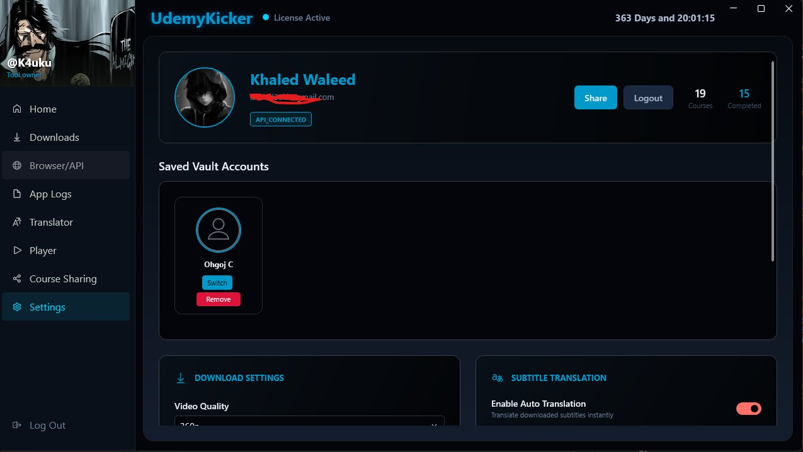

<span id="top"></span>
<h1 align="center">
  
  <br> UdemyKicker | The Ultimate Learning Utility
</h1>

<p align="center">
  <!-- Version -->
  <a href="https://github.com/your-username/UdemyKickerWPF/releases" target="_blank" rel="noopener noreferrer">
     
  </a>
  <!-- Platform -->
  <a href="#" target="_blank" rel="noopener noreferrer">
    
  </a>
  <!-- License -->
  <a href="https://github.com/your-username/UdemyKickerWPF/blob/master/LICENSE" target="_blank" rel="noopener noreferrer">
    
  </a>
</p>

<div align="center">
	
  <strong>UdemyKicker</strong> is the most powerful desktop application designed to give you complete freedom over your purchased Udemy courses. Watch them offline, translate them to your language, bypass playback restrictions, and share them with friends seamlessly.<br><br>

  <p align="center">
    
    
  </p>
  <p align="center">
    
    
  </p>
  <p align="center">
    
    
  </p>
  <p align="center">
    
  </p>
</div>

<br>

> [!WARNING]
> * **Personal Use Only:** This software is intended strictly to help you download Udemy courses for your own personal, offline use. 
> * **No Piracy Endorsement:** Sharing the content of your subscribed courses on public platforms is strictly prohibited. You must provide your own Udemy login credentials to download the courses you have legitimately enrolled in. 

---

## 🌟 Exclusive Features

UdemyKicker is packed with groundbreaking, exclusive features that you will not find in any other standard downloader (like Udeler). 

### 🔐 Unrestricted DRM Downloading
Unlike older tools that simply skip encrypted videos, UdemyKicker features an advanced decryption engine. It seamlessly unlocks and downloads DRM-protected (Widevine) courses, ensuring you get 100% of your course content, every single time. No more "Video Skipped" errors!

### 🌍 Real-Time Subtitle Translation
Want to learn a course that is only available in English? **UdemyKicker** breaks all language barriers! It integrates seamlessly with top-tier Cloud APIs (Google, DeepL, Bing Pro/Free) to deliver highly accurate translations on the fly. With a single click, it will automatically translate the entire course's subtitles before the download even begins. 

**Available Languages Include:**
* 🇸🇦 Arabic (العربية)
* 🇪🇸 Spanish (Español)
* 🇫🇷 French (Français)
* 🇩🇪 German (Deutsch)
* 🇮🇹 Italian (Italiano)
* 🇵🇹 Portuguese (Português)
* 🇷🇺 Russian (Русский)
* 🇹🇷 Turkish (Türkçe)
* 🇨🇳 Chinese (中文)
* 🇯🇵 Japanese (日本語)
* 🇰🇷 Korean (한국어)
* *...and over 100+ other languages supported by Cloud APIs!*

### 🤖 Zero-Setup Auto Login
Forget about installing complicated browser extensions just to log in! UdemyKicker features intelligent technology. The moment you open the app, it automatically detects your active Udemy sessions from Chrome, Edge, or Firefox and logs you in instantly. If you prefer, you can also use our secure built-in browser window to log in directly.

### 📦 Smart Course Sharing (.kcm)
Want to share a course with a friend? UdemyKicker uses a revolutionary **Manifest System**:
- **How it Works:** You can export any course from your library as a tiny, lightweight `.kcm` (Kicker Course Manifest) file. You simply send this kilobyte-sized file to your friend via email or chat.
- **No Video Transfer Required:** You do **NOT** need to download the actual heavy video files or send huge folders! The `.kcm` file contains all the necessary secure routing data.
- **Instant Access:** Your friend imports the `.kcm` file into their UdemyKicker app. The software will instantly reconstruct the course structure and allow them to download the videos directly to their machine, bypassing the need for them to own the course or for you to upload gigabytes of data.

### 🎬 Immersive Integrated Player
You don't need a third-party media player. UdemyKicker comes with a beautiful, distraction-free built-in video player designed specifically for learning. It supports translated subtitles, speed control, and tracks your viewing progress automatically.

### 🔎 Advanced Smart Filtering
Instantly find exactly what you're looking for in massive libraries. Our modern, compact search interface allows you to filter your courses by:
- **DRM Status:** Instantly see which courses are standard and which are encrypted (Widevine).
- **Course Rating:** Filter by minimum star ratings (e.g., 4.5+ stars).
- **Duration:** Find quick tutorials under 2 hours or deep-dives over 20 hours.
- **Publish Date:** Keep your learning up to date by filtering for recently updated courses.


### 🛡️ Multi-Account Vault
Have multiple Udemy accounts for different topics? The **Vault Accounts** feature allows you to securely save multiple login sessions. Our beautifully redesigned settings interface displays your accounts as clean circular avatars, allowing you to seamlessly switch between or share specific accounts with a single click.

---

## 📚 Comprehensive Content Support

UdemyKicker doesn't just download videos. It perfectly mirrors your entire course structure for offline studying, supporting every type of content Udemy offers:

- **📹 Video Lectures:** High-quality videos (up to 1080p), including both standard and Widevine DRM-encrypted formats.
- **📄 Article Lectures:** Text-based lessons are captured and saved beautifully for offline reading, preserving inline images and formatting.
- **📝 Quizzes & Assessments:** Downloads multiple-choice quizzes and practice tests so you can evaluate your knowledge offline.
- **📎 Downloadable Resources:** Automatically fetches all supplementary instructor materials, including PDFs, Slide presentations, and worksheets.
- **💻 Source Code & ZIPs:** Perfect for programming courses; it downloads all attached code repositories and ZIP files directly into the lecture's folder.
- **💬 Subtitles & Captions:** Downloads the original VTT/SRT caption files in all available languages, alongside any translated versions you requested.

---

## 🚀 Standard Features

In addition to its exclusive capabilities, UdemyKicker excels at all the essentials:

- **Lightning-Fast Downloads:** Uses multi-threaded, segmented downloading to max out your internet connection.
- **Select Video Quality:** Choose to download in 1080p, 720p, 480p, or 360p to save space.
- **Pause & Resume Anytime:** Close the app, restart your computer, or lose connection—your download will resume exactly where it left off.
- **Download Everything:** Automatically fetches not just videos, but also PDFs, source code ZIPs, articles, and supplementary resources.
- **Custom Directories:** Choose exactly where on your hard drive you want your courses organized.
- **Privacy First:** All your login sessions and personal data are kept strictly local and heavily obfuscated to protect your privacy.

---

## ⚙️ Installation & Setup

Before running UdemyKicker, please ensure you have the following prerequisites installed:

1. **Python & Required Libraries (First Step):**
   The decryption and download engine relies on Python. This is the very first step you must do.
   - Make sure you have Python installed and added to your system PATH.
   - Open your terminal or command prompt in the project folder and run the following command to install all required dependencies:
   ```bash
   pip install -r requirements.txt
   ```

2. **.NET 5 Desktop Runtime:** 
   UdemyKicker is built on WPF and requires the .NET 5 Desktop Runtime to run. 
   - [Download .NET 5.0 Desktop Runtime (x64)](https://dotnet.microsoft.com/en-us/download/dotnet/5.0) and install it on your Windows machine.


---

## 💎 Pricing & Subscription

UdemyKicker is a premium utility that gives you the ultimate freedom to download, translate, and watch your courses anywhere.

To ensure you always have access to these exclusive features and continuous updates, UdemyKicker is available for a simple subscription of **$10 per month**.

<p align="center">
  <a href="https://t.me/K4uku" target="_blank" rel="noopener noreferrer">
    
  </a>
  &nbsp;
  <a href="https://t.me/addlist/YW6TDW3k6vVmZGQ6" target="_blank" rel="noopener noreferrer">
    
  </a>
  &nbsp;
  
</p>


