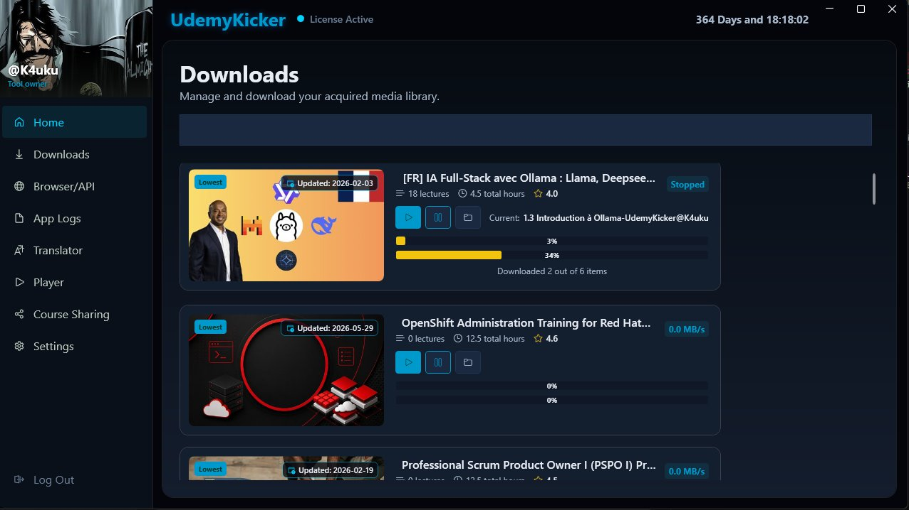
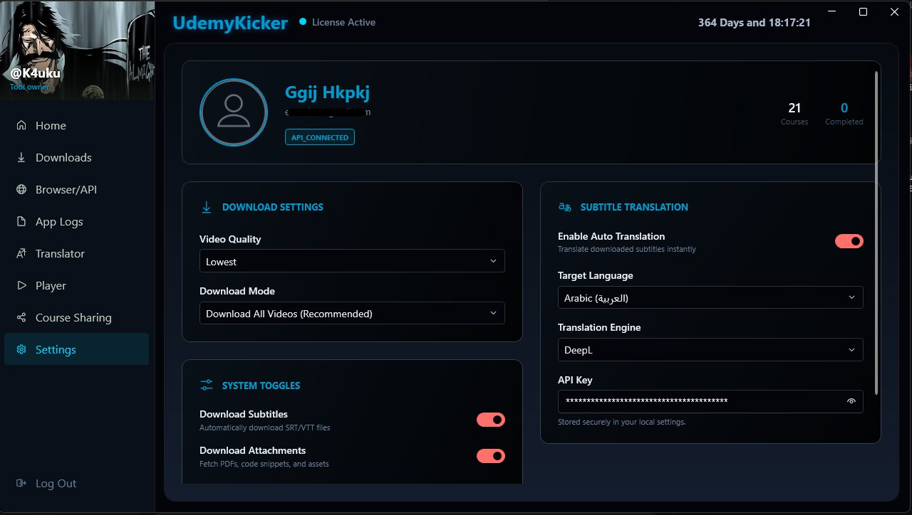
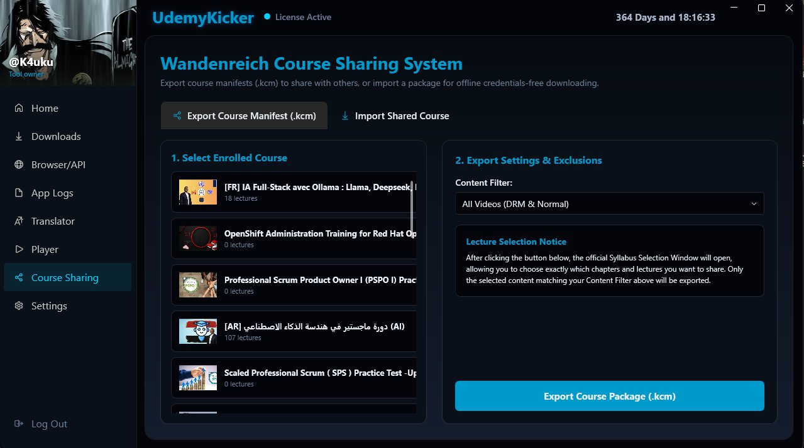
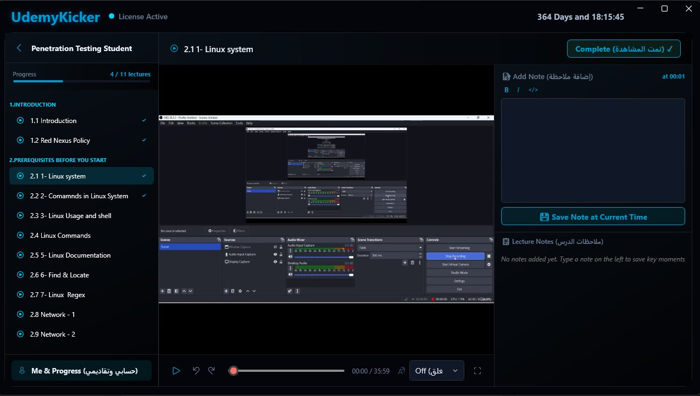
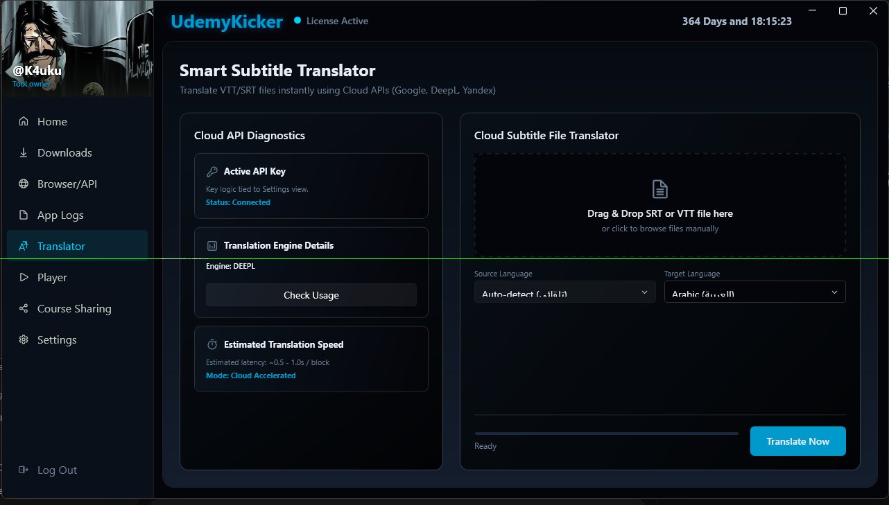

<h1 align="center">
  
    UdemyKicker | The Ultimate Learning Utility
</h1>

  <!-- Version -->
  
  <!-- Platform -->
  
  <!-- License -->
  

	
  <strong>UdemyKicker</strong> is the most powerful desktop application designed to give you complete freedom over your purchased Udemy courses. Watch them offline, translate them to your language, bypass playback restrictions, and share them with friends seamlessly.  
  
  

   
  <table border=0 cellspacing=5 cellpadding=5>
  <tr>
    <td></td>
    <td></td>
  </tr>
  <tr>
    <td></td>
    <td></td>
  </tr>
  <tr>
    <td colspan="2" align="center"></td>
  </tr>
  </table>  

 

> [!WARNING]
> * **Personal Use Only:** This software is intended strictly to help you download Udemy courses for your own personal, offline use. 
> * **No Piracy Endorsement:** Sharing the content of your subscribed courses on public platforms is strictly prohibited. You must provide your own Udemy login credentials to download the courses you have legitimately enrolled in. 

---

## 🌟 Exclusive Features

UdemyKicker is packed with groundbreaking, exclusive features that you will not find in any other standard downloader (like Udeler). 

### 🔐 Unrestricted DRM Downloading
Unlike older tools that simply skip encrypted videos, UdemyKicker features an advanced decryption engine. It seamlessly unlocks and downloads DRM-protected (Widevine) courses, ensuring you get 100% of your course content, every single time. No more "Video Skipped" errors!

### 🌍 Real-Time Subtitle Translation
Want to learn a course that is only available in English? UdemyKicker integrates directly with top-tier Cloud APIs (Google, DeepL, Yandex). With a single click, it will automatically translate the entire course's subtitles into Arabic, Spanish, French, or any language of your choice before the download even begins. 

### 🤖 Zero-Setup Auto Login
Forget about installing complicated browser extensions just to log in! UdemyKicker features intelligent **Cookie Scoop** technology. The moment you open the app, it automatically detects your active Udemy sessions from Chrome, Edge, or Firefox and logs you in instantly. If you prefer, you can also use our secure built-in browser window to log in directly.

### 📦 Smart Course Sharing (.kcm)
Want to share a course with a friend? UdemyKicker uses a revolutionary **Manifest System**:
- **How it Works:** You can export any course from your library as a tiny, lightweight `.kcm` (Kicker Course Manifest) file. You simply send this kilobyte-sized file to your friend via email or chat.
- **No Video Transfer Required:** You do **NOT** need to download the actual heavy video files or send huge folders! The `.kcm` file contains all the necessary secure routing data.
- **Instant Access:** Your friend imports the `.kcm` file into their UdemyKicker app. The software will instantly reconstruct the course structure and allow them to download the videos directly to their machine, bypassing the need for them to own the course or for you to upload gigabytes of data.

### 🎬 Immersive Integrated Player
You don't need a third-party media player. UdemyKicker comes with a beautiful, distraction-free built-in video player designed specifically for learning. It supports translated subtitles, speed control, and tracks your viewing progress automatically.

---

## 📚 Comprehensive Content Support

UdemyKicker doesn't just download videos. It perfectly mirrors your entire course structure for offline studying, supporting every type of content Udemy offers:

- **📹 Video Lectures:** High-quality videos (up to 1080p), including both standard and Widevine DRM-encrypted formats.
- **📄 Article Lectures:** Text-based lessons are captured and saved beautifully for offline reading, preserving inline images and formatting.
- **📝 Quizzes & Assessments:** Downloads multiple-choice quizzes and practice tests so you can evaluate your knowledge offline.
- **📎 Downloadable Resources:** Automatically fetches all supplementary instructor materials, including PDFs, Slide presentations, and worksheets.
- **💻 Source Code & ZIPs:** Perfect for programming courses; it downloads all attached code repositories and ZIP files directly into the lecture's folder.
- **💬 Subtitles & Captions:** Downloads the original VTT/SRT caption files in all available languages, alongside any translated versions you requested.

---

## 🚀 Standard Features

In addition to its exclusive capabilities, UdemyKicker excels at all the essentials:

- **Lightning-Fast Downloads:** Uses multi-threaded, segmented downloading to max out your internet connection.
- **Select Video Quality:** Choose to download in 1080p, 720p, 480p, or 360p to save space.
- **Pause & Resume Anytime:** Close the app, restart your computer, or lose connection—your download will resume exactly where it left off.
- **Download Everything:** Automatically fetches not just videos, but also PDFs, source code ZIPs, articles, and supplementary resources.
- **Custom Directories:** Choose exactly where on your hard drive you want your courses organized.
- **Privacy First:** All your login sessions and personal data are kept strictly local and heavily obfuscated to protect your privacy.

---

## ⚙️ Installation & Setup

Before running UdemyKicker, please ensure you have the following prerequisites installed:

1. **.NET 5 Desktop Runtime:** 
   UdemyKicker is built on WPF and requires the .NET 5 Desktop Runtime to run. 
   - [Download .NET 5.0 Desktop Runtime (x64)](https://dotnet.microsoft.com/en-us/download/dotnet/5.0) and install it on your Windows machine.

2. **Python & Required Libraries:**
   The decryption and download engine relies on Python. 
   - Make sure you have Python installed and added to your system PATH.
   - Run the included `install_requirements.py` script to install all the necessary Python libraries automatically.
   *(Alternatively, you can run the `setup_portable_python.bat` script provided in the folder to set up a portable environment).*

---

## 📖 How to Use

Using UdemyKicker is incredibly simple and requires no technical knowledge:

1. **Launch the App:** Open UdemyKicker. It will automatically detect your browser session and log you in.
2. **Browse Your Library:** All your enrolled courses will appear in a beautiful grid.
3. **Customize & Download:** Click on a course, choose your preferred video quality, select a language for subtitle translation (optional), and hit Download.
4. **Watch Offline:** Navigate to the "Downloads" tab or your Library to play your downloaded courses completely offline using the built-in player!

---

## 💎 Pricing & Subscription

UdemyKicker is a premium utility that gives you the ultimate freedom to download, translate, and watch your courses anywhere.

To ensure you always have access to these exclusive features and continuous updates, UdemyKicker is available for a simple subscription of **$10 per month**.

  <!-- Subscribe -->
  

## License

[MIT © Your Name](https://github.com/your-username/UdemyKickerWPF/blob/master/LICENSE) <a href="#top">🔝</a>
